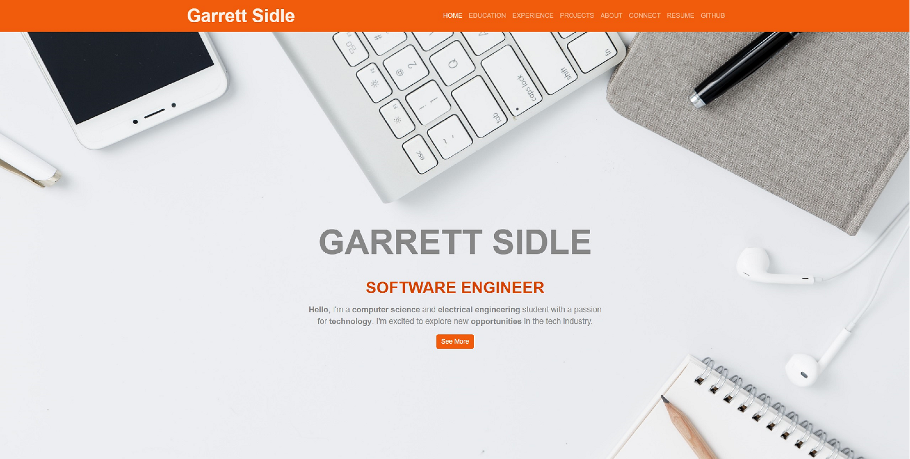
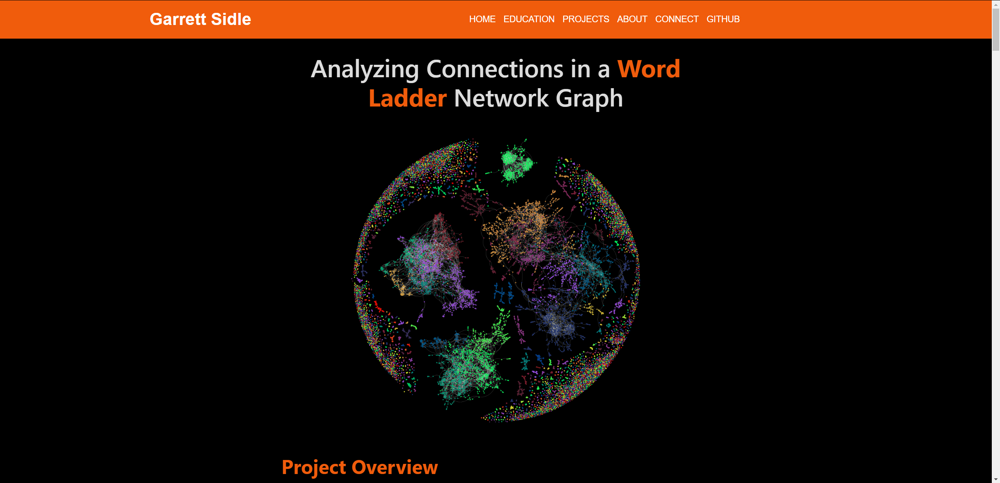

# Personal Website

## How to run
In order to run the project you simply need to install the required dependencies.
`npm install`

Then start the program.
`npm start`

## Project Overview
This is my personal website, which you're currently viewing. It was built using React to create a smooth, dynamic, and mobile-responsive user interface. With an emphasis on performance, I kept external dependencies to a minimum, ensuring a fast and efficient browsing experience. The website showcases a clean, modern design, offering an intuitive navigation system and dynamic content rendering. Hosted on AWS, the site is designed for scalability and high availability, providing a reliable user experience. It serves as both a portfolio and a space for showcasing various projects, reflecting my skills in web development and software engineering.

## Other Images
Blog Page

